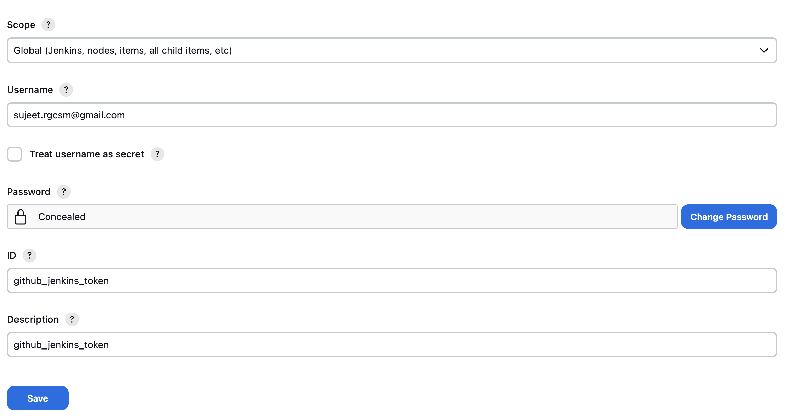
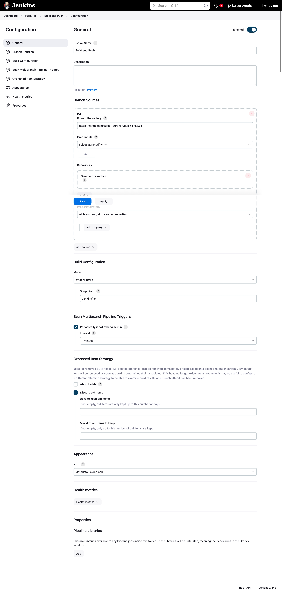
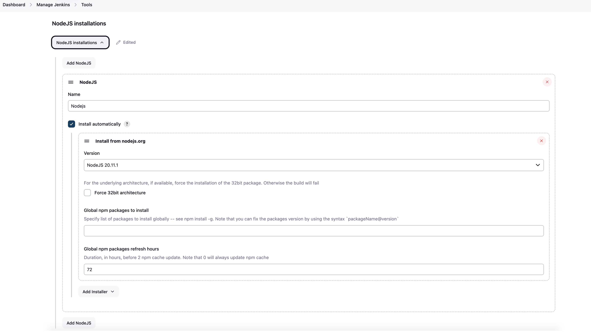

# Quick Links

---

Welcome to the Nest.js URL Shortener GitHub repository! This is a powerful and scalable solution designed to make shortening long URLs a breeze. The system has been deployed on a Kubernetes cluster, ensuring high availability and easy scalability. The URL Shortener utilizes the power of PostgreSQL for data storage and Redis for caching, providing a high-performance and reliable storage solution.

This repository provides an easy-to-deploy, open-source solution for anyone looking to shorten long URLs for social media posts, or those in need of a scalable solution for their business. The codebase is built using the Nest.js framework, which provides a modular and easily extensible architecture.

Feel free to explore the codebase and leverage the powerful technologies used in this project for your own URL shortening needs.

> [!IMPORTANT]  
> For step wise guidelines please follow [Step Wise Guidelines](#deployment)
>
> Learn about kubernetes in depth through the slides [Kubernetes](https://docs.google.com/presentation/d/1b_qoklJet4gUJBTFMud9JVrgqwGvI_uPyR1qWGcfDfk/edit?usp=sharing)
>
> To practice important concepts first follow [kubernetes-playground](./kubernetes-playground.md)
>
> The charts for the deployment are hosted at [quick-links-charts](https://github.com/sujeet-agrahari/quick-links-chart)
>
> For learning more on Helm and ArgoCD follow [Helm & ArgoCD](./helm-and-argocd.md)

## Database setup

The directory named **dbschema** includes a file named `quick-links.sql`, which contains the PostgreSQL database schema. The schema can also be viewed as an image.


## Installation

```bash
$ npm install
```

## Running the app

```bash
# run redis and postgres
$ docker-compose up -d db redis

# development
$ npm run start

# watch mode
$ npm run start:dev

# production mode
$ npm run start:prod
```

_You can access the API documentation by visiting http://localhost:3000/api once the application is running._

## Test

```bash
# unit tests
$ npm run test

# e2e tests
# it will also start redis and postgres for testing
$ npm run test:e2e

# test coverage
$ npm run test:cov
```

## Debug

Add below configuration in `launch.json` vscode.

```
{
  "version": "0.2.0",
  "configurations": [
    {
      "type": "node",
      "request": "attach",
      "name": "Attach NestJS WS",
      "port": 9229,
      "restart": true
    }
  ]
}
```

```bash
# unit tests
$ npm run start:debug

# after the server is running, go to vscode debug icon and click on "Attach NestJS WS"
```

## Deployment

We will be deploying the `quick-links` service in a local kubernetes cluster along with `PostgreSQL` and `Redis` cluster.

Also, we will setup `Kong` API gateway and we will use `Argocd` for continuous deployment.

We have two main directories to handles all of the deployment/setup tasks

- deploy: It has the deployment related files: `helm` chart and argocd `application` file
- kubernetes: It will have `kong` related setup files and `kubernetes` dashboard setup files

## Prerequisites

1. Make sure you have latest docker desktop version installed
2. Enable kubernetes
3. Install helm: `brew install helm`
4. Install `kubectl`: `brew install kubernetes-cli`

## Setup PostgreSQL cluster

```sh
# step 1
helm repo add bitnami https://charts.bitnami.com/bitnami

# step 2
helm install postgres bitnami/postgresql-ha \
--set global.postgresql.username="postgres" \
--set global.postgresql.password="password" \
--set global.postgresql.database="quicklink" \
--set global.postgresql.repmgrUsername="repmgr" \
--set global.postgresql.repmgrPassword="password" \
--set global.postgresql.repmgrDatabase="repmgr" \
--set global.pgpool.adminUsername="admin" \
--set global.pgpool.adminPassword="password" \
--set postgresqlImage.debug=true \
--create-namespace --namespace postgres
```

Once installed,

PostgreSQL can be accessed through Pgpool via port 5432 on the following DNS name from within your cluster:

```sh
 postgres-postgresql-ha-pgpool.postgres.svc.cluster.local
```

To get the password for the `postgres` user run:

```sh
kubectl get secret --namespace postgres postgres-postgresql-ha-postgresql -o jsonpath="{.data.password}" | base64 -d | pbcopy
```

To connect to your database and test from outside the cluster execute the following commands:

```sh
kubectl port-forward --namespace postgres svc/postgres-postgresql-ha-pgpool 5433:5432

# If you want to make accessible through th process, you can run in background process:

kubectl port-forward --namespace postgres svc/postgres-postgresql-ha-pgpool 5433:5432 &
```

## Setup Redis cluster

```sh
# Install redis - single mast and multiple slaves
helm install redis bitnami/redis --set global.redis.password="password" --create-namespace --namespace redis


# Redis can be accessed on the following DNS names from within your cluster:

# redis-master.default.svc.cluster.local for read/write operations (port 6379)
# redis-replicas.default.svc.cluster.local for read-only operations (port 6379)

# To get your password run:
kubectl get secret --namespace default redis -o jsonpath="{.data.redis-password}" | base64 -d | pbcopy

# To connect to your database from outside the cluster execute the following commands:

kubectl port-forward --namespace redis svc/redis-master 6379:6379 &
```

## Setup Kubernetes dashboard

```sh
helm repo add kubernetes-dashboard https://kubernetes.github.io/dashboard/

helm install k8s-dashboard kubernetes-dashboard/kubernetes-dashboard --create-namespace --namespace k8s-dashboard

# To access the dashboard run the following command:
kubectl apply -f kubernetes/k8s-dashboard/service-account.yaml
kubectl apply -f kubernetes/k8s-dashboard/cluster-role-and-binding.yaml


# Get the token
kubectl create token dashboard-sa -n k8s-dashboard | pbcopy

kubectl -n k8s-dashboard port-forward k8s-dashboard-pod-name 8443:8443


# OR
kubectl proxy
# http://localhost:8001/api/v1/namespaces/kubernetes-dashboard/services/https:kubernetes-dashboard:https/proxy/#/login


```

## Setup Kong

```sh
# default namesapce
helm install kong kong/kong  --set admin.useTLS=false,admin.enabled=true,admin.http.enabled=true,env.admin_gui_path=/kong-manager,env.admin_gui_url=http://localhost/kong-manager,env.admin_gui_api_url=http://localhost/kong-admin
```

## Setup Argocd

```sh
kubectl create namespace argocd

kubectl apply -n argocd -f https://raw.githubusercontent.com/argoproj/argo-cd/stable/manifests/install.yaml


# to serve on http you need add toplevel at indent metadata
# Go to kubernetes dashboard and update the argocd-cmd-params-cm config map
# data:
#    server.insecure: "true"
#    server.rootpath: /argocd -> it is needed to run behind proxy

kubectl get secrets -n argocd argocd-initial-admin-secret -o yaml

# Decode the password field got from above command
echo NkZoc3E0RW45OTZDRDlJdg== | base64 --decode
# user will be admin only

# Make argocd to poll within given time
# Change argocd-cm config map, add below at the level of metadata
# data:
#  timeout.reconciliation: 30s

```

## Create Ingress for accessing service via Kong

```
kubectl apply -f kubernetes/kong/argocd-ingress.yaml
kubectl apply -f kubernetes/kong/kong-admin-ingress.yaml
kubectl apply -f kubernetes/kong/kong-manager-ingress.yaml
kubectl apply -f kubernetes/kong/quick-links-ingress.yaml
```

## Deploy the app using argo cd

```sh
# Make sure you build the app first
docker build . --target dev -t quick-links:dev

kubectl apply -f deploy/application.yaml
```

## Setting up Jenkins Pipeline with GitHub Integration

```sh
brew install jenkins

brew services start jenkins

# Go to http://localhost:8080/ get the password from cat /Users/userName/.jenkins/secrets/initialAdminPassword
```

Follow these steps to configure a Jenkins Pipeline for your GitHub repository:

1. Go to Jenkins Dashboard.

2. Create a New Item:

   - Navigate to the Jenkins Dashboard.
   - Click on the "New Item" option in the left-hand side menu.

3. Give Name `quick-links` and choose folder:
   - Provide a name for your new item, such as "quick-links".
   - Choose the appropriate folder or organization where you want to place this item.
   - Click on the "OK" or "Apply" button to proceed.



4. Create a new item inside this folder:

   - Name it `Build and Push`.
   - Choose the type of item as `Multibranch Pipeline`.
   - This allows Jenkins to automatically discover branches in your repository and create pipelines for each branch.

5. Generate a new personal auth token in GitHub:

   - Go to your GitHub account settings.
   - Under "Developer settings", click on "Personal access tokens".
   - Generate a new token with the necessary permissions.
   - Use this token as the password when adding Git credentials in Jenkins.

6. Go to Credentials and add Git credentials:
   - Navigate to the Jenkins Dashboard.
   - Click on "Credentials" from the left-hand side menu.
   - Click on "Add credentials" and fill in the required fields.
   - Use the generated personal access token from GitHub as the password.


7. Add the branch source in the multiple pipeline configuration:

   - In the configuration settings for the `Build and Push` item (Multibranch Pipeline), add the branch source for your repository.
   - This tells Jenkins which repository and branches to monitor for changes and build triggers.
     

8. Go to Manage Jenkins and install plugin NodeJS Plugin:

   - From the Jenkins Dashboard, navigate to "Manage Jenkins".
   - Click on "Manage Plugins" and install the "NodeJS Plugin".
   - Search for it in the available plugins list and select it for installation.

9. Enable the Nodejs tool:
   - After installing the NodeJS Plugin, go back to "Manage Jenkins" and click on "Global Tool Configuration".
   - Here, you can enable the Node.js tool by adding a new installation.
   - Specify the desired version and ensure that the checkbox for "Install automatically" is selected.


