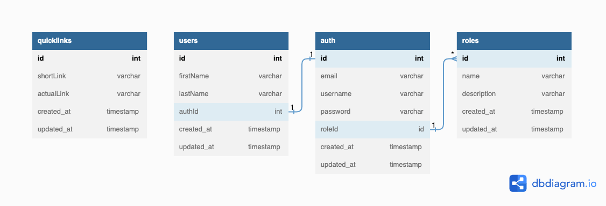

# Quick Links

---

Welcome to the Nest.js URL Shortener GitHub repository! This is a powerful and scalable solution designed to make shortening long URLs a breeze. The system has been deployed on a Kubernetes cluster, ensuring high availability and easy scalability. The URL Shortener utilizes the power of PostgreSQL for data storage and Redis for caching, providing a high-performance and reliable storage solution.

This repository provides an easy-to-deploy, open-source solution for anyone looking to shorten long URLs for social media posts, or those in need of a scalable solution for their business. The codebase is built using the Nest.js framework, which provides a modular and easily extensible architecture.

Feel free to explore the codebase and leverage the powerful technologies used in this project for your own URL shortening needs.

## Database setup
The directory named **dbschema** includes a file named `quick-links.sql`, which contains the PostgreSQL database schema. The schema can also be viewed as an image.

## Installation

```bash
$ npm install
```

## Running the app

```bash
# run redis and postgres
$ docker-compose up -d db redis

# development
$ npm run start

# watch mode
$ npm run start:dev

# production mode
$ npm run start:prod
```

## Test

```bash
# unit tests
$ npm run test

# e2e tests
# it will also start redis and postgres for testing
$ npm run test:e2e

# test coverage
$ npm run test:cov
```

## Debug

```bash
# unit tests
$ npm run start:debug

# after the server is running, go to vscode debug icon and click on "Attach NestJS WS"
```

## Setup Kubernetes

Contains all the configuration yaml files inside `kubernetes-config` directory.

### Enable kubernetes in docker-desktop app

_Tried `minikube`, but on `mac` it was too slow._

- Install `kubectl`

```sh
  brew install kubernetes-cli
```

- Install `helm`

```sh
  brew install helm
```

### Add Bitnami Chart Repo

```sh
helm repo add bitnami https://charts.bitnami.com/bitnami

```

### Setup Postgresql Cluster

```sh
helm install postgres bitnami/postgresql-ha \
--set global.postgresql.username="postgres" \
--set global.postgresql.password="password" \
--set global.postgresql.database="quicklink" \
--set global.postgresql.repmgrUsername="repmgr" \
--set global.postgresql.repmgrPassword="password" \
--set global.postgresql.repmgrDatabase="repmgr" \
--set global.pgpool.adminUsername="admin" \
--set global.pgpool.adminPassword="password" \
--set postgresqlImage.debug=true

# PostgreSQL can be accessed through Pgpool via port 5432 on the following DNS name from within your cluster:

postgres-postgresql-ha-pgpool.default.svc.cluster.local

# Pgpool acts as a load balancer for PostgreSQL and forward read/write connections
# to the primary node while read-only connections are forwarded to standby nodes.

# To get the password for "postgres" run:

export POSTGRES_PASSWORD=$(kubectl get secret --namespace default postgres-postgresql-ha-postgresql -o jsonpath="{.data.password}" | base64 -d)
echo $POSTGRES_PASSWORD

# To get the password for "repmgr" run:

export REPMGR_PASSWORD=$(kubectl get secret --namespace default postgres-postgresql-ha-postgresql -o jsonpath="{.data.repmgr-password}" | base64 -d)
echo $REPMGR_PASSWORD

# To connect to your database run the following command:

kubectl run postgres-postgresql-ha-client --rm --tty -i --restart='Never' --namespace default --image docker.io/bitnami/postgresql-repmgr:15.2.0-debian-11-r0 --env="PGPASSWORD=$POSTGRES_PASSWORD"  \
--command -- psql -h postgres-postgresql-ha-pgpool -p 5432 -U postgres -d quicklink

# To connect to your database from outside the cluster execute the following commands:

# Port forward and connect
# Port forward and throw in backgroud process
kubectl port-forward --namespace default svc/postgres-postgresql-ha-pgpool 5433:5432 &
psql -h 127.0.0.1 -p 5432 -U postgres -d quicklink

```

### Setup Redis Cluster

```sh
# Install redis - single mast and multiple slaves
helm install redis bitnami/redis


# Redis&reg; can be accessed on the following DNS names from within your cluster:

redis-master.default.svc.cluster.local for read/write operations (port 6379)
redis-replicas.default.svc.cluster.local for read-only operations (port 6379)


# To get your password run:

export REDIS_PASSWORD=$(kubectl get secret --namespace default redis -o jsonpath="{.data.redis-password}" | base64 -d)

# To connect to your Redis&reg; server:

# Run a Redis&reg; pod that you can use as a client:

kubectl run --namespace default redis-client --restart='Never'  --env REDIS_PASSWORD=$REDIS_PASSWORD  --image docker.io/bitnami/redis:7.0.8-debian-11-r0 --command -- sleep infinity

Use the following command to attach to the pod:

kubectl exec --tty -i redis-client \
--namespace default -- bash

#  Connect using the Redis&reg; CLI:
REDISCLI_AUTH="$REDIS_PASSWORD" redis-cli -h redis-master
REDISCLI_AUTH="$REDIS_PASSWORD" redis-cli -h redis-replicas

# To connect to your database from outside the cluster execute the following commands:

kubectl port-forward --namespace default svc/redis-master 6379:6379 &
REDISCLI_AUTH="$REDIS_PASSWORD" redis-cli -h 127.0.0.1 -p 6379
```

### Setup Kubernetes Dashboard

- Create a service account
  ```sh
  kubectl apply -f ./kubernetes/service-accounts/k8s-dashboard.service-account.yaml
  ```
- Create cluster-level role binding
  ```sh
  kubectl apply -f ./kubernetes/service-accounts/k8s-cluster-level.role-binding.yaml
  ```
  We can also create a role-binding for a namespace
  ```sh
  kubectl apply -f ./kubernetes/service-accounts/k8s-dashboard.role-binding.yaml
  ```
- Generate access token for a service account

  ```sh
  # Get the token for the service account by running the following command:

  kubectl describe secret $(kubectl get secret | grep dashboard-sa | awk '{print $1}') | grep token:
  #If above doesn't work - dashboard-sa => is service account
  kubectl create token dashboard-sa
  ```

  ***

  [Kubernetes Introduction](https://github.com/sujeet-agrahari/quick-links/blob/main/kubernetes/Introduction.md)
