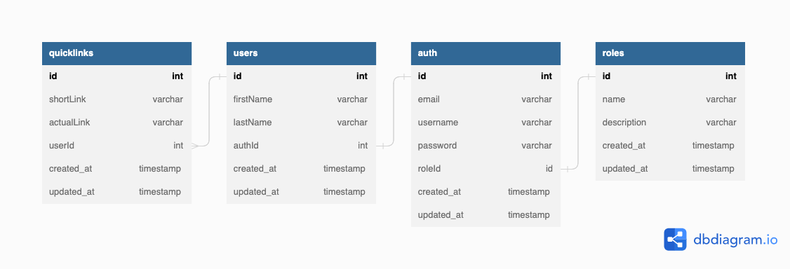

# Quick Links

---

Welcome to the Nest.js URL Shortener GitHub repository! This is a powerful and scalable solution designed to make shortening long URLs a breeze. The system has been deployed on a Kubernetes cluster, ensuring high availability and easy scalability. The URL Shortener utilizes the power of PostgreSQL for data storage and Redis for caching, providing a high-performance and reliable storage solution.

This repository provides an easy-to-deploy, open-source solution for anyone looking to shorten long URLs for social media posts, or those in need of a scalable solution for their business. The codebase is built using the Nest.js framework, which provides a modular and easily extensible architecture.

Feel free to explore the codebase and leverage the powerful technologies used in this project for your own URL shortening needs.

> [!IMPORTANT]  
> Learn about kubernetes in depth through the slides [Kubernetes](https://docs.google.com/presentation/d/1b_qoklJet4gUJBTFMud9JVrgqwGvI_uPyR1qWGcfDfk/edit?usp=sharing)
>
> To practice important concepts first follow [kubernetes-playground](./kubernetes-playground.md)
>
> For step wise guidelines please follow [Step Wise Guidelines](./step-wise-guideline.md)
>
> The charts for the deployment are hosted at [quick-links-charts](https://github.com/sujeet-agrahari/quick-links-chart)

## Database setup

The directory named **dbschema** includes a file named `quick-links.sql`, which contains the PostgreSQL database schema. The schema can also be viewed as an image.


## Installation

```bash
$ npm install
```

## Running the app

```bash
# run redis and postgres
$ docker-compose up -d db redis

# development
$ npm run start

# watch mode
$ npm run start:dev

# production mode
$ npm run start:prod
```

_You can access the API documentation by visiting http://localhost:3000/api once the application is running._

## Test

```bash
# unit tests
$ npm run test

# e2e tests
# it will also start redis and postgres for testing
$ npm run test:e2e

# test coverage
$ npm run test:cov
```

## Debug

Add below configuration in `launch.json` vscode.

```
{
  "version": "0.2.0",
  "configurations": [
    {
      "type": "node",
      "request": "attach",
      "name": "Attach NestJS WS",
      "port": 9229,
      "restart": true
    }
  ]
}
```

```bash
# unit tests
$ npm run start:debug

# after the server is running, go to vscode debug icon and click on "Attach NestJS WS"
```
