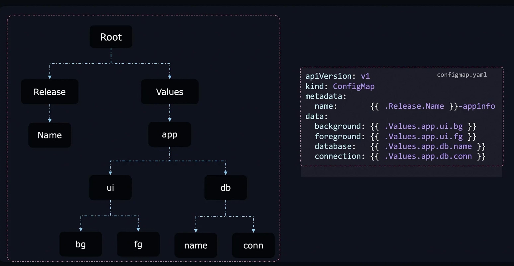
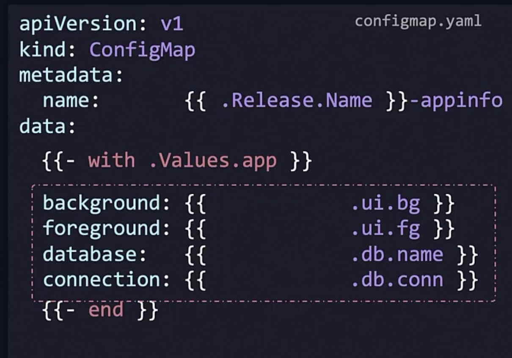
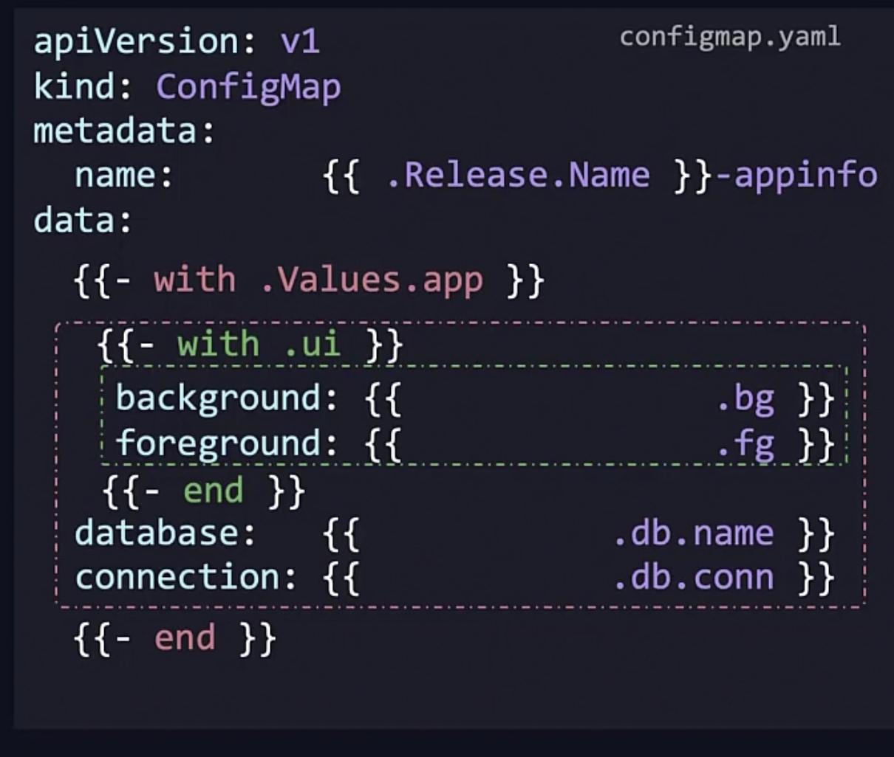

### Table of Contents

- [Helm](#helm)
  - [Usage](#usage)
  - [Helm Conditionals](#helm-conditionals)
  - [Helm Functions](#helm-functions)
  - [Helm Loops](#helm-loops)
  - [Helm Hooks](#helm-hooks)
  - [Available Helm Hooks](#available-helm-hooks)
  - [Creating a Hook](#creating-a-hook)
  - [Helm Pipelines](#helm-pipelines)
  - [Helm Scope](#helm-scope)
  - [Helm Templates](#helm-templates)
  - [Verifying Helm Charts](#verifying-helm-charts)
  - [Named Templates](#named-templates)
  - [Helper Templates](#helper-templates)
  - [When to Use `include` Instead of `template`](#when-to-use-include-instead-of-template)
- [ArgoCD](#argocd)
  - [ArgoCD](#argocd-1)
  - [ArgoCD Application](#argocd-application)
  - [ArgoCD Architecture](#argocd-architecture)

# Helm

Helm is package manager for Kubernetes. An application in Kubernetes contains multiple components/objects. The components and objects are created using a YAML configuration files.

These files are appended to the cluster using `kubectl` command.

Managing/tracking/debugging these files is very complicated and time consuming.

Helm simplifies the process of managing and deploying applications on Kubernetes by providing a set of command-line tools and a package format called charts. Charts are collections of pre-configured Kubernetes resources, such as deployments, services, and ingress rules, that can be easily installed and managed using Helm. Helm also provides a repository system for sharing and reusing charts, making it easier to find and use applications in Kubernetes.

When a chart is installed into the cluster using helm, it create a release. Each release is tracked by revision number. Whenever we make any change to the chart, a new revision is created.

It follows a specific directory structure,

```
chartName/
  ├── Chart.yaml          # A YAML file containing information about the chart
  ├── LICENSE             # (Optional) A file containing the license for the chart
  ├── README.md           # (Optional) A file containing documentation for the chart
  ├── values.yaml         # A YAML file containing default values for the chart
  ├── charts/             # A directory containing any dependent charts
  ├── templates/          # A directory containing template files
  │   ├── _helpers.tpl    # (Optional) A file containing template helpers
  │   ├── deployment.yaml # A template file for creating a Kubernetes Deployment
  │   ├── service.yaml    # A template file for creating a Kubernetes Service
  │   └── ingress.yaml     # A template file for creating a Kubernetes Ingress
  └── ...                 # Other files and directories as needed
```

The above directory structure can be created using,

```
helm create chartName
```

### Usage

To override values in the configuration file, we can pass `--set`,

```bash
helm install --set key=value my-release chartName

# or to pass more values
helm install --set key1=value1 --set key2=value2 my-release chartName
```

You can also, put all the values in another configuration file and refer to that in the command,

```bash
helm install --values custom.values.yaml my-release chartName
```

You can also pass a specific version of the chart to be installed,

```bash
helm install my-release chartName --version versionNumber
```

```bash
helm history releaseName
```

will give more information on the revision history of the release

## Helm Conditionals

```helm
{{- if .Values.label }}
 label: {{.Values.label}} // this key will not be available if .Values.label is not specified
{{- end }}
```

`-` only indicates to trim the whitespace or empty line after the final rendering

```helm
{{- if .Values.enableFeature }}
  feature:
    enabled: true
{{- else if eq .Values.enableAlternative true}}
  alternative:
    enabled: true
{{- else }}
  default:
    enabled: true
{{- end }}
```

Same as `eq` there is also ne, le, gt, ge, not, and empty.

We can even make the whole creation of the template conditional,

```
{{- if .Values.serviceAccount.create }}
apiVersion: v1
kind: ServiceAccount
metadata:
  name: {{ include "mychart.serviceAccountName" . }}
  labels:
    {{- include "mychart.labels" . | nindent 4 }}
{{- end }}
```

## Helm Functions

It helps to transform any values before it is applied ot actual template.

For example,

```
image: {{ upper .Values.image.repository }} -> image: 'NGINX'

image: {{ quote .Values.image.repository }} -> image: "NGINX"

image: {{ replace "X" "Y" .Values.image.repository }} -> image: 'NGINY'

image: {{ shuffle .Values.image.repository }} -> image: 'nxign'
```

[More here](https://helm.sh/docs/chart_template_guide/function_list/)

## Helm Loops

Suppose you have `Values.yaml` as below,

```
regions:
  - name: "Region 1"
    description: "Description for Region 1"
  - name: "Region 2"
    description: "Description for Region 2"
  # Add more regions as needed
```

You can have loop inside your template like below:

```
apiVersion: v1
kind: ConfigMap
metadata:
  name: {{ .Release.Name }}-metadata
data:
  regions: |
    {{- range .Values.regions }}
    - name: {{ .name }}
      description: {{ .description }}
    {{- end }}
```

The above will result in the following,

```
apiVersion: v1
kind: ConfigMap
metadata:
  name: my-release-metadata
data:
  regions: |
    - name: Region 1
      description: Description for Region 1
    - name: Region 2
      description: Description for Region 2
```

If the regions are just a list like,

```
regions:
  - "Region 1"
  - "Region 2"
  # Add more regions as needed
```

Then you can use just `.` to refer to the value,

```
apiVersion: v1
kind: ConfigMap
metadata:
  name: {{ .Release.Name }}-metadata
data:
  regions: |
    {{- range .Values.regions }}
    - {{ . | quote}}
    {{- end }}
```

## Helm Hooks

Helm hooks are special annotations that you can add to your Kubernetes manifest files to control the timing of their execution during the Helm lifecycle. They allow you to perform actions before or after specific events, such as installing, upgrading, or deleting a release.

Here are some common use cases for Helm hooks:

1. Pre/post-install/upgrade/delete operations: You can use hooks to run custom scripts or commands before or after installing, upgrading, or deleting a release. This can be useful for tasks like setting up database migrations, initializing configuration, or cleaning up resources.

2. Wait for external resources: Some applications require external resources to be available before they can start. You can use hooks to wait for these resources to become ready before continuing with the installation or upgrade process.

3. Rollbacks: If a deployment fails or a rollback is required, Helm hooks can be used to clean up any resources that were created during the installation or upgrade process.

Here's an example of how you can use a Helm hook to run a custom script before an installation:

```yaml
apiVersion: batch/v1
kind: Job
metadata:
  name: {{ .Release.Name }}-pre-install
  annotations:
    "helm.sh/hook": pre-install
    "helm.sh/hook-weight": "-5"
    "helm.sh/hook-delete-policy": hook-succeeded # it deletes the hooks after it succeeded
spec:
  template:
    spec:
      containers:
      - name: pre-install-script
        image: alpine:latest
        command: ["/bin/sh", "-c", "echo 'Running pre-install script...'"]
      restartPolicy: Never
```

Helm hooks allow you to control the timing of actions during the Helm lifecycle, such as running custom scripts or waiting for external resources. They are particularly useful for tasks that need to be performed before or after specific events, such as installing, upgrading, or deleting a release. In the example provided, a pre-install hook is used to run a custom script before the installation process starts.

1. Pre-upgrade - perform a backup before upgrading
2. Post-upgrade - send a notification that upgrade is done

## Available Helm Hooks

Helm provides several built-in hooks that you can use to control the timing of actions during the Helm lifecycle. Here is a list of all available hooks:

1. `pre-install`: Executed before a new release is installed.
2. `post-install`: Executed after a new release is installed.
3. `pre-upgrade`: Executed before an existing release is upgraded.
4. `post-upgrade`: Executed after an existing release is upgraded.
5. `pre-rollback`: Executed before a release is rolled back to a previous version.
6. `post-rollback`: Executed after a release is rolled back to a previous version.
7. `pre-delete`: Executed before a release is deleted.
8. `post-delete`: Executed after a release is deleted.

These hooks can be used to perform various tasks, such as running custom scripts, waiting for external resources, or cleaning up resources.

To use a hook, you can add annotations to your Kubernetes manifest files. Here's an example of how to use the `pre-upgrade` hook:

```yaml
apiVersion: batch/v1
kind: Job
metadata:
  name: {{ .Release.Name }}-pre-upgrade
  annotations:
    "helm.sh/hook": pre-upgrade
    "helm.sh/hook-weight": "-5"
    "helm.sh/hook-delete-policy": hook-succeeded
spec:
  template:
    spec:
      containers:
      - name: pre-upgrade-script
        image: alpine:latest
        command: ["/bin/sh", "-c", "echo 'Running pre-upgrade script...'"]
      restartPolicy: Never
```

## Creating a Hook

To create a Helm hook, you need to define a Kubernetes manifest file that includes the necessary annotations. Here's an example of how to create a pre-upgrade hook:

1.  Create a new YAML file, for example, pre-upgrade-hook.yaml.
2.  Add the following content to the file:

```go
apiVersion: batch/v1
kind: Job
metadata:
  name: {{ .Release.Name }}-pre-upgrade
  annotations:
    "helm.sh/hook": pre-upgrade
    "helm.sh/hook-weight": "-5"
    "helm.sh/hook-delete-policy": hook-succeeded
spec:
  template:
    spec:
      containers:
      - name: pre-upgrade-script
        image: alpine:latest
        command: ["/bin/backup.sh", "-c", "echo 'Running pre-upgrade script...'"]
      restartPolicy: Never
```

To run multiple hooks in the same phase, we give them weights.
It is sorted in ascending order of the weights and the smallest weight is the first one to be executed.

If same weight is given to two hooks, they will be sorted by Kind and finally by the name and they will be executed in that order.

## Helm Pipelines

Passing input to something,

```bash
image: {{ .Values.image.repository | upper | quote | shuffle }} -> image: XI"GNN"
```

## Helm Scope

`.` refers to the root scope.

If no scope is set the current file will refer to the root scope.



Using `with` block we can define the scope,





To refer to root scope we can use `$`,

```
release: {{ $.Release.name }}
```

## Helm Templates

`{{ .Release.name }}-nginx`

- `{{` template directory
- It starts with a path
- `.` refers to the root level or top level scope

For `Release, Chart, and Capabilities` the second object starts with capital letters because these are built in objects.

But, for `Values` the second object starts with lower case letters and follows camel casing.

`{{.Value.replicaCount}}`

Other keys under `.Value.keys` can be accessed using `.Values.keys.key1`

For example,

```yaml
replicaCount: 1

image:
  repository: nginx
  pullPolicy: IfNotPresent
  tag: 1.0.0
```

To access tag or other keys under `.Values.image`,
we can access using `.Values.image.tag` etc.

So, Template + Release Details + Chart Details + Values = Final Configuration File

## Verifying Helm Charts

1. Lint: formatting error on yaml or wrong names
2. Template: It renders the final output after overriding all the values defined
   ```bash
   helm template ./chart-dir --debug
   ```
3. Dry Run: To catch the errors occurred at the kubernetes/cluster level
   ```
   helm install my-release chartName --dry-run
   ```

## Named Templates

Reusing code and remove duplication.

Create another file `_helpers.tpl`

`_` in the file name tells the Helm not to consider the file as user template file.

Because, Helm reads all the files inside templates and translates them to kubernetes objects.

Then we can name these lines in `_helpers.tpl` as below and refer them inside the template.

## Helper Templates

To avoid code duplication, you can create a helper template in Helm. In this example, let's create a helper template to format region data.

First, create a new file named `_helpers.tpl` in the `templates` directory.

```go
{{- define "region.format" -}}
- name: {{ .name }}
  description: {{ .description }}
{{- end }}
```

Now, you can use this helper template in your main template like this:

```go
apiVersion: v1
kind: ConfigMap
metadata:
  name: {{ .Release.Name }}-metadata
data:
  regions: |
    {{- range .Values.regions }}
    {{ template "region.format" . }} # . here refers to the current scope and we are passing this to helper template
    {{- end }}
```

inserted templates will have the same indent as defined in the helper.

To use different indentation we must pipe it to `indent` function, but `template` does not output anything that can be piped to the `indent` so we must use `include` instead of `template`.

## When to Use `include` Instead of `template`

In Helm, the `include` function is used to include a template and capture its output, which can then be piped to other functions like `indent`. The `template` function, on the other hand, includes a template but does not capture its output.

Here's an example to illustrate when to use `include` instead of `template`:

Suppose you have a helper template named `region.format` in `_helpers.tpl`:

```go
{{- define "region.format" -}}
- name: {{ .name }}
  description: {{ .description }}
{{- end }}
```

Now, let's say you want to include this template in your main template and indent the output by 2 spaces. You can use include like this:

```go
apiVersion: v1
kind: ConfigMap
metadata:
  name: {{ .Release.Name }}-metadata
data:
  regions: |
    {{- range .Values.regions }}
    {{- include "region.format" . | indent 2 }} # . here refers to the current scope and we are passing this to helper template
    {{- end }}
```

In the example provided, the `include` function is used to include the `region.format` template and pipe its output to the `indent` function. This allows for the desired indentation of the included template.

On the other hand, if you try to use the `template` function and pipe its output to the `indent` function, you will get an error because `template` does not output anything that can be piped. In this case, you must use `include` instead of `template` to capture the output of the helper template and then indent it.

# ArgoCD

ArgoCD is a GitOps tool for Kubernetes that ensures consistency, automates deployments, and provides visibility across clusters. It uses Git as the source of truth, enabling version control and easy rollbacks. ArgoCD simplifies multi-cluster management and enhances security through centralized access control. It streamlines continuous delivery for cloud-native applications, bridging the gap between DevOps teams and Kubernetes environments.

ArgoCD monitors a Git repository containing your application's desired state (Kubernetes manifests, Helm charts, etc.). When changes are detected, it automatically syncs the Kubernetes cluster to match the repo. For example, if you update a deployment file in Git to increase replicas, ArgoCD will apply this change to the cluster. It provides a UI for monitoring sync status and managing deployments across multiple clusters.

## ArgoCD

1. Sync: Applies the desired state in Git to the cluster.
2. Sync Status: Displays the status of the sync operation whether the desired status matches to target state in the cluster.
   - OutOfSync: The desired state in Git does not match the live state in the cluster.
   - Synced: The desired state in Git matches the live state in the cluster.
3. Sync Operation Status: Whether or not a sync succeeded.
   - Failed: The sync failed.
   - Sync Ok: The sync succeeded.
4. Refresh: Manually trigger comparison of the latest code in Git with the live status and figure out the differences. If diff found, it will mark sync status as OutOfSync
5. Health: Shows the health of the application.
   - Healthy: The resource is healthy
   - Progressing: The resource is not healthy yet but might be soon
   - Degraded: A failure or inability to reach to the healthy state
   - Suspended: The resource is suspended/paused and waiting for an external event to resume
   - Missing: Resource is not present in the cluster
   - Unknown: The health of the resource failed

- You can further write custom health check script in lua. Define this custom health check in argocd config map

## ArgoCD Application

- Source: repo url
- Destination: cluster url

In ArgoCD, there are different strategies available for synchronization, pruning, and self-healing:

Sync Strategies:

Automatic Sync: Automatically syncs the desired state in Git with the target state in the cluster whenever changes are detected in the Git repository.
Manual Sync: Requires manual intervention to trigger the synchronization process, giving the user control over when changes are applied to the cluster.
Pruning:

Automatic Pruning: Automatically removes resources from the cluster that are no longer defined in the Git repository. This helps maintain the cluster in sync with the desired state.

Self-Healing:

Automatic Self-Healing: Monitors the cluster for any discrepancies between the desired state in Git and the actual state in the cluster. It automatically takes corrective actions to bring the cluster back to the desired state without manual intervention.
Example:

Automatic Sync: If a deployment file is updated in the Git repository, ArgoCD will automatically sync the changes to the cluster.
Automatic Pruning: If a resource is deleted from the Git repository, ArgoCD will automatically remove the corresponding resource from the cluster.
Automatic Self-Healing: If a pod goes down unexpectedly, ArgoCD will automatically restart the pod to maintain the desired state.

## ArgoCD Architecture

ArgoCD architecture consists of the following components:

Application Controller: Responsible for managing the lifecycle of applications deployed in Kubernetes clusters. It continuously monitors the desired state defined in Git repositories and ensures that the actual state of applications matches the desired state.

Repo Server: Handles communication with Git repositories, syncing application manifests, and managing repository credentials. It connects to the Git repositories specified in the Application resources.

Redis: Used for caching and storing application state information, improving performance and scalability.

Metrics Server: Collects and exposes metrics related to ArgoCD operations, allowing monitoring and performance analysis.

API Server: Provides a REST API for interacting with ArgoCD, enabling users to manage applications, repositories, and other configurations.

UI Server: Offers a web-based user interface for visualizing application deployments, sync status, and managing configurations.

Dex (Optional): Provides authentication and authorization services, allowing integration with external identity providers.

```
+---------------------+       +---------------------+       +---------------------+
|    Application      |       |      Repo Server    |       |       Redis         |
|      Controller     |       |                     |       |                     |
|                     |       |                     |       |                     |
+---------------------+       +---------------------+       +---------------------+
          |                           |                           |
          |                           |                           |
          |                           |                           |
          |                           |                           |
          |                           |                           |
          |                           |                           |
+---------------------+       +---------------------+       +---------------------+
|    Metrics Server   |       |      API Server     |       |       UI Server     |
|                     |       |                     |       |                     |
|                     |       |                     |       |                     |
+---------------------+       +---------------------+       +---------------------+
```
